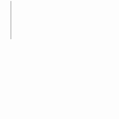

<p align="center">
  
</p>

The ttf font generator used by [Asciinotes](https://asciinotes.com/).

Convert [FIGlet](https://github.com/patorjk/figlet.js/tree/main) fonts into TrueType (.ttf) font files.

FIGlet fonts render text as ASCII art. This tool takes a FIGlet font and a glyph source font (any .ttf file, ideally monospace), and produces a new .ttf where each character looks like its FIGlet ASCII art representation. Each cell of the ASCII art is drawn using the corresponding glyph from the source font.

## Requirements

- [Bun](https://bun.sh/) runtime

## Install

```bash
git clone https://github.com/WillH0lt/FIGlet-To-TTF.git
cd figlet-to-ttf
bun install
```

## Usage

### CLI

```bash
bun run cli.ts [options]
```

**Options:**

- `-f, --figlet-font <name|path>` — FIGlet font name (e.g. `Standard`, `Big`, `Slant`) or path to a `.flf` font file.
- `-a, --all` — Generate a TTF for every built-in FIGlet font. Mutually exclusive with `-f`.
- `-g, --glyph-font <path>` — Path to a .ttf font file used to draw individual glyphs (default: `cascadiaMono.ttf`).
- `-o, --output <path>` — Output file path (default: `out/<figlet-font>.ttf`). Only used when generating a single font.
- `--family-name <name>` — Font family name embedded in the output TTF (default: the FIGlet font name). Only used when generating a single font.
- `-c, --chars <file>` — Path to a text file containing space-separated characters to include (default: `chars.txt`).
- `-h, --help` — Show help

Either `-f` or `--all` must be specified.

### Examples

Generate a TTF from the "Standard" FIGlet font:

```bash
bun run cli.ts -f Standard
```

Generate TTFs for all built-in FIGlet fonts:

```bash
bun run cli.ts --all
```

Use a custom `.flf` font file:

```bash
bun run cli.ts -f ./my-custom-font.flf
```

Specify an output path and glyph font:

```bash
bun run cli.ts -f Big -g ./myFont.ttf -o ./fonts/big-figlet.ttf
```

### As a library

```ts
import { figletToTtf } from './index'

const outputPath = await figletToTtf({
  figletFont: 'Standard',
  glyphFontPath: './cascadiaMono.ttf',
  output: './my-font.ttf',
})

console.log(`Font written to ${outputPath}`)
```

#### Options

| Option | Type | Required | Description |
|--------|------|----------|-------------|
| `figletFont` | `string` | Yes | Built-in FIGlet font name |
| `glyphFontPath` | `string` | Yes | Path to a .ttf glyph source font |
| `output` | `string` | No | Output file path |
| `familyName` | `string` | No | Font family name in the output |
| `chars` | `string[]` | No | Characters to include (default: printable ASCII) |

## Pre-generated fonts

The `/out` directory contains pre-generated TTF files for all built-in FIGlet fonts, created using [Cascadia Mono](https://fonts.google.com/specimen/Cascadia+Mono) as the glyph source font.

## How it works

1. For each character in the character set, the tool renders it through the FIGlet font to produce ASCII art
2. Each character in the ASCII art is then drawn using the corresponding glyph from the source .ttf font
3. These paths are combined into a single glyph outline for that character
4. All glyphs are assembled into a new TrueType font with proper metrics

## Available FIGlet fonts

FIGlet ships with many built-in fonts. For example:

- `Standard` — the default FIGlet font
- `Big` — larger block letters
- `Slant` — italicized style
- `Banner` — wide banner text
- `Small` — compact version
- `Mini` — minimal size

See [figlet.js/fonts](https://github.com/patorjk/figlet.js/tree/main/fonts) for a full list of available FIGlet fonts.

## License

MIT
